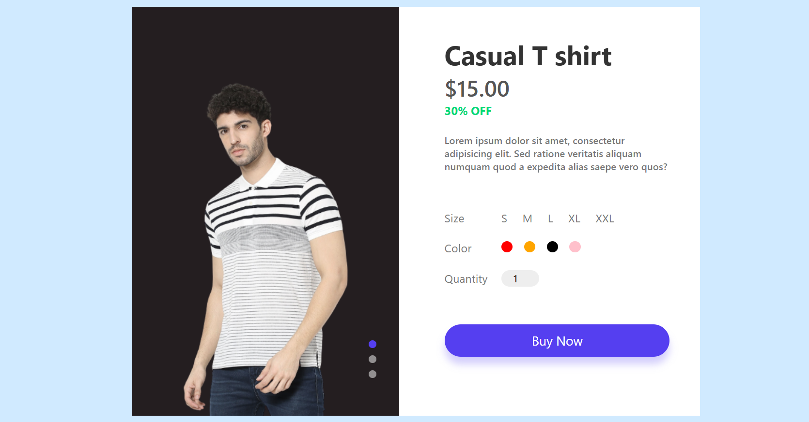
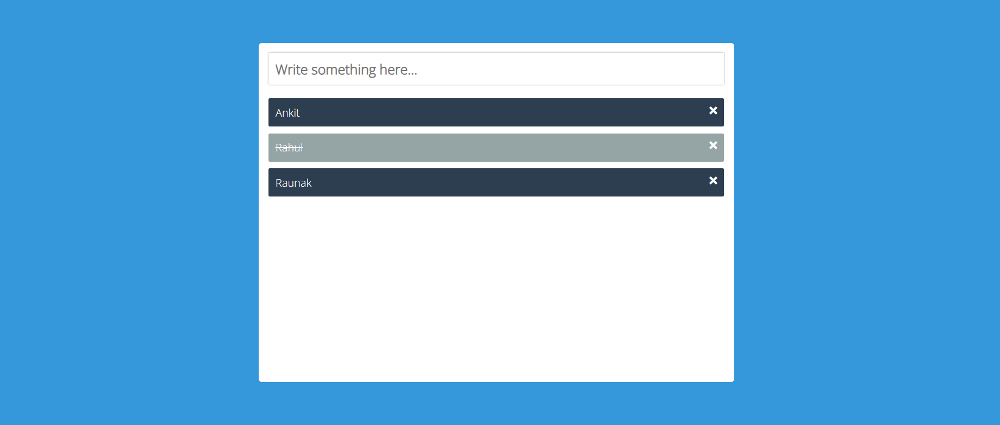
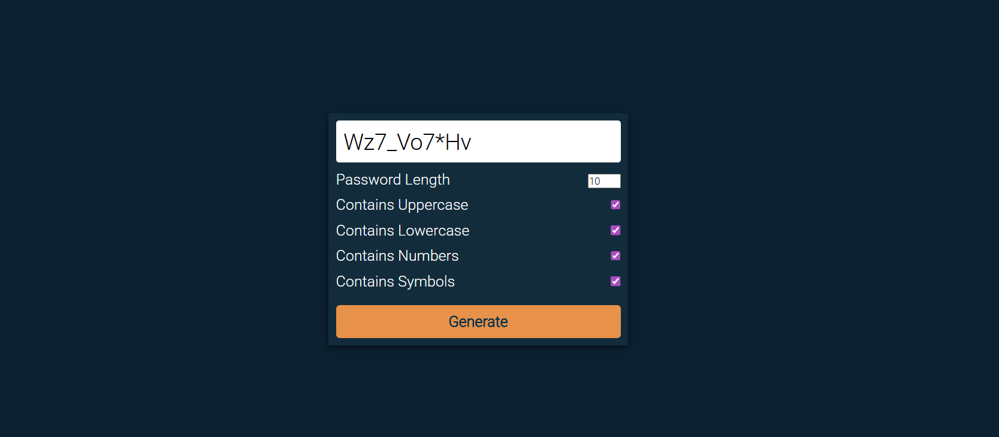

# 🛍️ Product Preview Page – JavaScript Mini Project

This is a simple **Product Preview Webpage** built using **HTML, CSS, and JavaScript**.

## 📸 Screenshot

---
It displays a clothing product with:
- 3-view image slider (front, side, back)
- Size selection
- Color selection
- Quantity input
- “Buy Now” button

All interactions (image switching, active states) are written with **pure JavaScript** — no frameworks.

---

## 🚀 Features

### ✔ Product Image Slider  
Users can switch between **three product images** by clicking the small slider buttons.

### ✔ Size Selector  
Sizes: **S, M, L, XL, XXL**

### ✔ Color Selector  
Selectable color circles (Red, Orange, Black, Pink).

### ✔ Quantity Counter  
Allows user to input how many pieces they want.

### ✔ Clean UI & Responsive Layout  
Modern design using pure CSS and Flexbox.

 
# 📝 To-Do App (JavaScript Mini Project)

A simple and clean **To-Do List application** built using **HTML, CSS, and JavaScript**.  
This project is part of my **JavaScript Mini Projects Collection**, where I am building 10+ small projects to master DOM manipulation and core JS concepts.

 

📸 Screenshot

 
🚀 Features

- ➕ Add new tasks  
- ✔ Mark tasks as completed  
- ❌ Delete tasks  
- 💾 Automatically clears input after adding  
- 🧼 Prevents empty input  
- ✨ Clean UI & minimal CSS  
- 🧠 Beginner-friendly DOM operations  

 

🔐 Random Password Generator (JavaScript)
 

📸 Screenshot

 

🚀 Features

🔀 Generates fully random passwords

🔢 Supports numbers, symbols, uppercase & lowercase

🎚 Adjustable password length

📋 One-click copy to clipboard

⚡ Instant password refresh

✨ Clean UI with simple CSS

🧠 Beginner-friendly logic & DOM manipulation

 
🛠 Tech Stack

- **HTML5**  
- **CSS3**  
- **JavaScript (Vanilla JS)**  
- **Font Awesome Icons**

